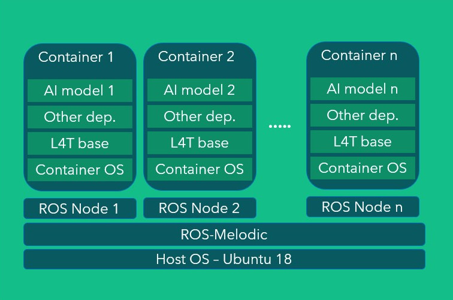

# Integration of AI Models with ROS

## Overview
The purpose of this repositiry is to integrate a wide range of docker containerized AI models into ROS so that they can run with other robot specific ROS nodes.  

This is not advised to use separate hardware units for robot and AI models. In order to use a single unit for both the AI models and robot, this intgeration plays a vital role. 

The main hardware components we have in our robot are as follows
- [Azure Kinect](https://azure.microsoft.com/en-us/services/kinect-dk/#overview)
- [RPLidar A2](https://www.slamtec.com/en/Lidar/A2)
- [Jetson Xavier NX](https://developer.nvidia.com/embedded/jetson-xavier-nx-devkit)
- Android Tablet
- Microphone and speakers

In this integration architecture, ROS Melodic is running on host OS (Ubuntu 18.04) and every containerized AI model is loaded/unloaded inside a ROS node. This ROS node takes sensor stream from a respectice ROS topic and pass it to the container via a Flask bridge. The same node also gets the model output and publishes it to the desired ROS topic. The visual illustration of the architecture can be seen below.




## Pre-Requisite Installations
After clonning the repository, do the following pre-requisite installtions & make sure you have a successful compilation of your package. Look at the Appendix at the end of this documentation which lists some possible errors and their solutions. 

- Nvidia jetson Jetpack 4.6 with Ubuntu 18.04 [(install guide)](https://developer.nvidia.com/embedded/jetpack) 
- ROS Melodic [(install guide)](http://wiki.ros.org/melodic/Installation/Ubuntu) 
- k4a SDK for Azure Kinect [(install guide)](https://github.com/microsoft/Azure_Kinect_ROS_Driver/blob/melodic/docs/building.md) 


## Setup

The third-party libraries are added as submodules along with other developed ROS packages.  
Before cloning this repository, first setup the ROS workspace and src folders.  
```
mkdir catkin_ws #can be a different name
cd catkin_ws
mkdir src
```

After creating workspace, go to src directory of workspace and clone the repository along with submodules (note the dot `.` at the end of the command).
```
cd catkin_ws/src
git clone https://github.com/Xavorcorp/ros_ai_integ.git
```

Go back to workspace home directory, install dependencies and build it.
```
cd catkin_ws
rosdep install --from-paths src --ignore-src -r -y
catkin_make
```

## Usage
Instructions are given [here](./ros_ai/scripts/README.md) to run a containerized person tracking model with ROS and Azure Kinect.


## APPENDIX

### Some Commond Errors & Their Solutions

1. Compilation error due to OpenCV version mismatch on Jetson Xavier:
 
   If you encoutner error due to OpenCV package version mismatch, do the following on command line. Further details related to this issue can be seen [here](https://answers.ros.org/question/199279/installation-from-source-fails-because-of-cv_bridge-include-dir/).

   ``` sudo ln -s /usr/include/opencv4/opencv2/ /usr/include/opencv ```

2. Everything compiles successfully but Azure Kinect driver crashes with "no camera found" or any other such error:

    Ensure that you have followed all pre-requisite installations correctly. Specifically see if you have properly set the k4A rules in the Linux Udev rules. See "Linux Device Setup" at the end of this [link](https://github.com/microsoft/Azure-Kinect-Sensor-SDK/blob/develop/docs/usage.md#Installation).  
   
   Make sure you have k4A installed correclty. To ensure, connect external LCD display to Jetson Xavier & run the k4A utility from command line using: 

   ``` sudo k4aviewer```

   Select the camera from dropdown menu and see if the camera and point cloud feed is accessible. 

   If the utility works fine then you have correclty installated the K4A libraries & the error is due to some other issue. 

3. Unable to Run Azure Kinect Driver using SSH:
   
   If you are unable to run the Kinect driver using SSH from you PC. Set the parameter below from the command line where you are running the driver. 

   ```export DISPLAY=:0```